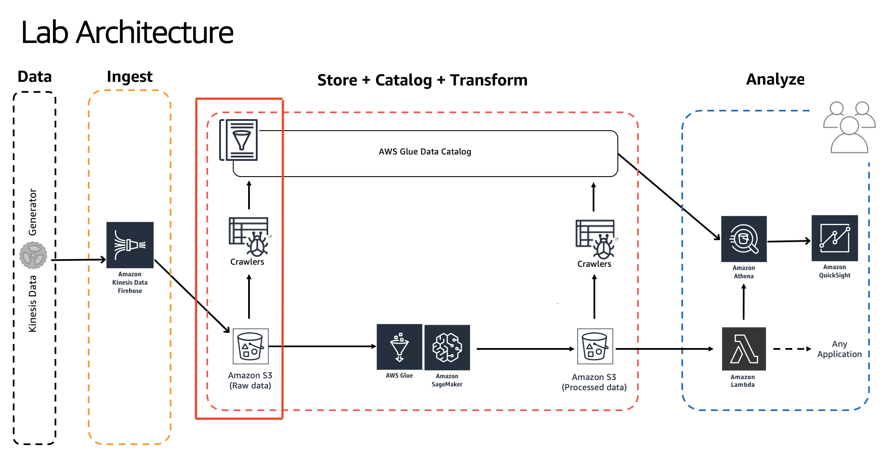

# Building Serverless Data Lakes on AWS

Author: Unni Pillai | Amazon Web Services | [Twitter](https://twitter.com/unni_k_pillai) | [Linkedin](http://bit.ly/upillai)

Updated by: Vikas Omer | Amazon Web Services | [Linkedin](https://www.linkedin.com/in/vikas-omer/)



# Pre-requisites:  
Completed the previous modules   
* Ingest and Storage [link](../modules/ingest.md)

# Catalog Data

## Create IAM Role

In this step we will navigate to IAM Console & create a new Glue service role, this allows AWS Glue to access data sitting in S3 and create necessary entities in Glue catalog.

* GoTo: https://console.aws.amazon.com/iam/home?region=us-east-1#/roles
* Click - **Create role**
    * Choose the service that will use this role: **Glue**
    * Click - **Next: Permissions**
    * Search for - **AmazonS3FullAccess**
        * Select **Checkbox**
    * Search for - **AWSGlueServiceRole**
        * Select **Checkbox**
    * Click - **Next: Tags**
	    * Leave as default, no changes here
    * Click - **Next: Review**
    * Role name: **AWSGlueServiceRoleDefault**
    * make sure that are two policies attached to this role (**AmazonS3FullAccess**, **AWSGlueServiceRole**)
    * Click - **Create role**


## Create AWS Glue Crawlers

In this step, we will navigate to AWS Glue Console & create glue crawlers to discovery the newly ingested data in S3.

* GoTo: https://console.aws.amazon.com/glue/home?region=us-east-1
* On the left panel, click on **Crawlers** > Click on **Add Crawler**
    * Crawler info
        * Crawler name: **summitcrawler**
        * Click - **Next**
    * Data store
        * Data store: **S3**
        * Crawl data in: **Specified path in my account**
        * Include path: **s3://yourname-datalake-demo-bucket/data/**
        * Click - **Next**
        * Add another data store : **No**
        * Click - **Next**
    * IAM Role
        * Choose: **Choose an existing IAM role**
        * Role Name: **AWSGlueServiceRoleDefault**
        * Click - **Next**
    * Schedule
        * Frequency: **Run on demand**
        * Click - **Next**
    * Output
        * Click - Add database
        * Database name: **summitdb**
        * Click - **Create**
        * Click - **Next**
    * Review all steps
        * Review the configuration & make sure its as mentioned above
        * Click - **Finish**
* You should see a message : Crawler summitcrawler was created to run on demand.
    * Click - **Run on demand** This will run the crawler
    * Wait for few minutes

## Verify newly created tables in catalog

Navigate to Glue Catalog & explore the crawled data:

* GoTo : https://console.aws.amazon.com/glue/home?region=us-east-1#catalog:tab=databases 
    * Click - **summitdb**
* Click - **Tables in summitdb**
    * Click - **raw**
    * Look around and explore the schema for your dataset
        * look for the `averageRecordSize`, `recordCount`, `compressionType`

## Query ingested data using Amazon Athena

Lets query newly ingested data using Amazon Athena

* GoTo : https://us-east-1.console.aws.amazon.com/athena/home?region=us-east-1#query
* On the left panel (**Database**) drop down , select **summitdb** > select table **raw**
* Click on **3 dots** (3 vertical dots) > Select **Preview Table**
* Review the output 
* In query editor, paste the following query > Click on **Run Query**

```
SELECT activity_type,
         count(activity_type)
FROM raw
GROUP BY  activity_type
ORDER BY  activity_type
```


> Back to [main page](../readme.md)
