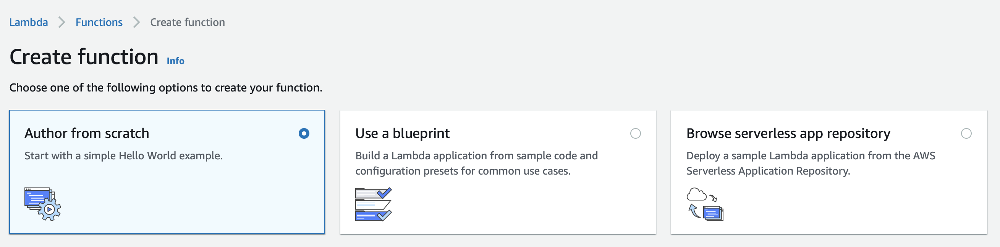
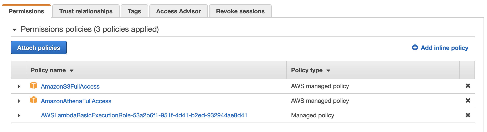
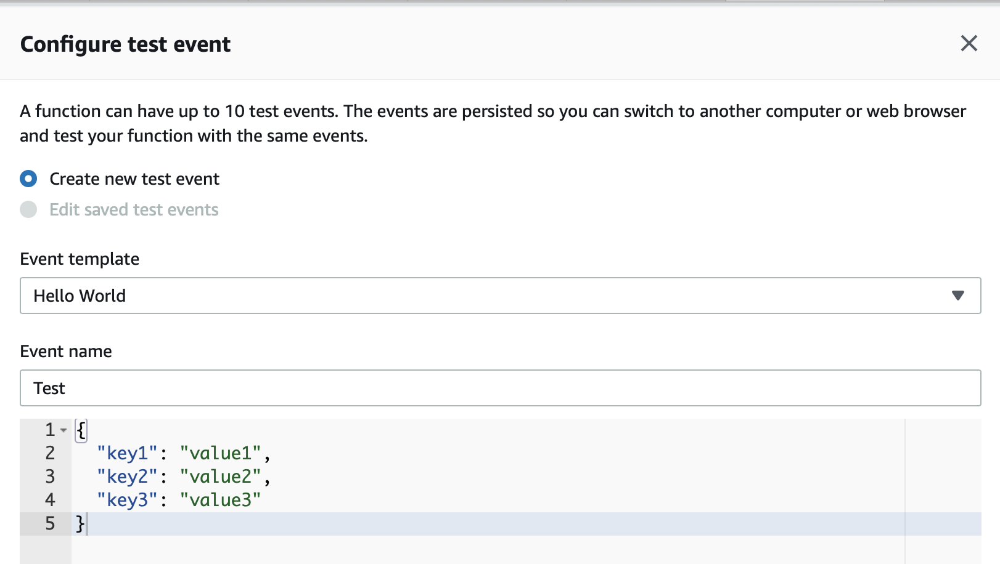

# Building Serverless Data Lakes on AWS

Author: Unni Pillai | Amazon Web Services | [Twitter](https://twitter.com/unni_k_pillai) | [Linkedin](http://bit.ly/upillai)

Updated by: Vikas Omer | Amazon Web Services | [Linkedin](https://www.linkedin.com/in/vikas-omer/)


# Pre-requisites:  
Completed the previous modules   
* Ingest and Storage [link](./modules/ingest.md)
* Catalog Data [link](./modules/catalog.md)
* Transform Data with AWS Glue [link](./modules/transform_glue.md)
* Lambda [link](./modules/lambda.md)


# Lambda

Let's create a Lambda Function which will host the code for Athena to query and fetch Top 5 Popular Songs by Hits from processed data.

## Create S3 Folder for storing Query Results

In this section, we will create a folder under bucket created in the previous lab to store the query results produced by Athena.

Login to AWS Console: https://console.aws.amazon.com/console/home?region=us-east-1

Navigate to S3 Console in us-east-1 region :

- GoTo : https://s3.console.aws.amazon.com/s3/home?region=us-east-1

- Add new folder for query results data

  - Open - **yourname-datalake-demo-bucket** 

    - Click - **Create folder**
      - New folder called : **query_results**
      - Click - **Save**

    

## Create Lambda Function

In this section, we will create the required Lambda Function.

Navigate to Lambda console and create a new lambda function:

- GoTo: https://console.aws.amazon.com/lambda/home?region=us-east-1

  **Note:** Make sure Region is selected as **US East (N. Virginia)** which is us-east-1

- Click: **Create function** (if you are using Lambda for the first time, then you might have to click Get Started to ptoceed)

- Select **Author from scratch**

  

- Under **Basic Information**, 

  - Give Function name as **top5Songs**
  - Select Runtime as **Python 3.7**
  - Expand **Choose or create an execution role** under Permissions, make sure **Create a new role with basic Lambda permissions** is selected.


- Click **Create Function**


## Author Lambda Function

In this section, we will provide code to the lambda function which we just created. We will use `boto3` to access Athena client. 

> Boto is the Amazon Web Services (AWS) SDK for Python. It enables Python developers to create, configure, and manage AWS services, such as EC2 and S3. Boto provides an easy to use, object-oriented API, as well as low-level access to AWS services. Read more about Boto here - https://boto3.amazonaws.com/v1/documentation/api/latest/index.html?id=docs_gateway
>
> Read more about Boto3 Athena API methods here - https://boto3.amazonaws.com/v1/documentation/api/latest/reference/services/athena.html


### Function Code

- Scroll down to Function Code section and replace existing code under lambda_function with the below:

  **<u>Note</u>**: Replace **yourname** in `S3_OUTPUT = 's3://yourname-datalake-demo-bucket/query_results/'` with the name you used in previous lab.

  ```python
  import boto3
  import time
  import os
  
  # Environment Variables
  DATABASE = os.environ['DATABASE']
  TABLE = os.environ['TABLE']
  
  # Top X Constant
  TOPX = 5
  
  # S3 Constant
  S3_OUTPUT = 's3://yourname-datalake-demo-bucket/query_results/'
  
  
  # Number of Retries
  RETRY_COUNT = 10
  
  def lambda_handler(event, context):
      # TODO implement
      
      client = boto3.client('athena')
      
      # query constant with two environment variables and a constant
      query = "select track_name as \"Track Name\",artist_name as \"Artist Name\",count(1) as \"Hits\" FROM %s.%s group by 1,2 order by 3 desc limit %s;" % (DATABASE, TABLE, TOPX)
      
      response = client.start_query_execution(
          QueryString=query,
          QueryExecutionContext={
              'Database': DATABASE
          },
          ResultConfiguration={
                  'OutputLocation': S3_OUTPUT
          }
      )
  
      query_execution_id = response['QueryExecutionId']
  
   # Get Execution Status
      for i in range(0, RETRY_COUNT):
  
          # Get Query Execution
          query_status = client.get_query_execution(QueryExecutionId=query_execution_id)
          query_execution_status = query_status['QueryExecution']['Status']['State']
          
          if query_execution_status == 'SUCCEEDED':
              print("STATUS:" + query_execution_status)
              break
  
          if query_execution_status == 'FAILED':
              raise Exception("STATUS:" + query_execution_status)
  
          else:
              print("STATUS:" + query_execution_status)
              time.sleep(i)
      else:
          client.stop_query_execution(QueryExecutionId=query_execution_id)
          raise Exception('TIME OVER')
  
       # Get Query Results
      result = client.get_query_results(QueryExecutionId=query_execution_id)
      print(result['ResultSet']['Rows'])
      
      # Function can return results to your application or service
      #return result['ResultSet']['Rows']
  ```


### Environment Variables

- Scroll down to **Environment variables** section and add below two Environment variables.

  - Key: **DATABASE**, Value: **summitdb**

  - Key: **Table**, Value: **processed_data**

    

  

  

  > Environment variables for Lambda functions enable you to dynamically pass settings to your function code and libraries, without making changes to your code. Read more about Lambda Environment Variables here - https://docs.aws.amazon.com/lambda/latest/dg/env_variables.html


### Execution Role

- Scroll down to **Execution role** Section:

  - Click and open the **View the top5Songs-role-<id> role** in a new tab. It will open this role in IAM console.

  ​			

- In new tab, under IAM console role Permissions, click **Attach policies** and add the following two policies (search in filter box, check and hit Attach policy):

  - AmazonS3FullAccess

  - AmazonAthenaFullAccess

    

- Once these policies are attached to the role, close this tab.


### Basic Settings

Basic settings allow us to configure memory and timeout parameters for the lambda functions.

- Leave the **Memory (MB)** as defult which is 128 MB
- Change **Timeout** to 10 seconds.

- 

We are now done with most of the settings we needed in order to execute our lambda function.

- Leave all other settings as default.
- Hit **Save** on the top right hand corner of the console.


## Configuring Test Event

Our function is now ready to be tested. Lets configure a dummy test event to see execution results of our newly created lambda function.

- Click **Test** on right top hand corner of the lambda console.

- A new window will pop up for us to configure test event.

  - **Create new test event** is selected by default.

  - Event template: **Hello World**

  - Event name: **Test**

  - Leave everything as is and hit create at the bottom right corner of this window.

    

- Click **Test** again

  - You should be able to see the output in json format under **Execution Result** section:

    


Alternatively, if you have aws cli configured on your machine, 

- Make the following minor changes to the code:

  - Comment print statement (not required)

    ```python
    print(result['ResultSet']['Rows'])
    to
    #print(result['ResultSet']['Rows'])
    ```

  - Uncomment return section (required)

    ```python
    #return result['ResultSet']['Rows'] 
    to
    return result['ResultSet']['Rows']
    ```

- Use the following command to invoke lambda function using CLI.

  `aws lambda invoke --function-name top5Songs response.json`

- Function should return 200 response code.

  ```json
  {
      "StatusCode": 200,
      "ExecutedVersion": "$LATEST"
  }
  ```

- See response.json file for the output.

  ```shell
  cat response.json
  ```


## Verification through Athena

Let's verify the results through Athena

Login to the Amazon Athena Console.

- GoTo: https://console.aws.amazon.com/athena/home?region=us-east-1#query

- As Athena uses the AWS Glue catalog for keeping track of data source, any S3 backed table in Glue will be visible to Athena.

- On the left panel, select ‘**summitdb**’ from the dropdown

- Run the following query :

  ```sql
  select track_name as "Track Name",artist_name as "Artist Name",count(1) as "Hits" FROM summitdb.processed_data group by 1,2 order by 3 desc limit 5;
  ```

- Compare the results of this query with the results of lambda function. It should be same.


### GREAT! 

### You have now created a lambda function from scratch and tested it.
      


> Back to [main page](../readme.md)