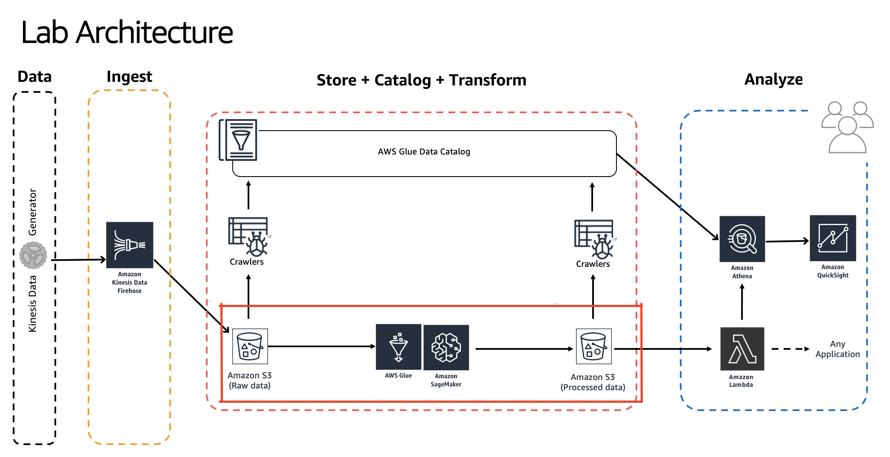

# Building Serverless Data Lakes on AWS

Author: Unni Pillai | Amazon Web Services | [Twitter](https://twitter.com/unni_k_pillai) | [Linkedin](http://bit.ly/upillai)

Updated by: Vikas Omer | Amazon Web Services | [Linkedin](https://www.linkedin.com/in/vikas-omer/)

# Pre-requisites:  
Completed the previous modules   
* Ingest and Storage [link](../modules/ingest.md)
* Catalog Data [link](../modules/catalog.md)

# Transform Data

## Create Glue Development Endpoint
In this step you will be creating a glue endpoint to interactively develop Glue ETL scripts using PySpark

* GoTo : https://console.aws.amazon.com/glue/home?region=us-east-1#etl:tab=devEndpoints
* Click - **Add endpoint**
  * Development endpoint name - **devendpoint1**
    * IAM role - **AWSGlueServiceRoleDefault**
    * Expand - **Security configuration.. parameters**
      * Data processing units (DPUs): **2** (this affects the cost of the running this lab)
  * Click - **Next**
  * Networking screen :
    * Choose - **Skip networking information**
  * Add an SSH public key (Optional)
    * Leave as defaults
    * Click: **Next**
  * Review the settings
    * Click: **Finish**

It will take close to 10 mins for the new Glue console to spin up.

You have to wait for this step to complete before moving to next step.

## Create SageMaker Notebooks (Jupyter) for Glue Dev Endpoints

* GoTo: https://console.aws.amazon.com/glue/home?region=us-east-1#etl:tab=notebooks
* Select tab : **Sagemaker notebooks**
* Click: **Create notebook**
  * Notebook name: **notebook1**
  * Attach to development endpoint: **devendpoint1**
  * Choose: **Create an IAM role**
  * IAM Role: **notebook1**
  * VPC (optional): Leave blank
  * Encryption key (optional): Leave blank
  * Click: **Create Notebook**

This will take few minutes, wait for this to finish

## Launch Jupyter Notebook
- Download and save this file locally on your laptop : [summit-techfest-datalake-notebook.ipynb](../summit-techfest-datalake-notebook.ipynb)
- GoTo: https://console.aws.amazon.com/glue/home?region=us-east-1#etl:tab=notebooks
- Click - **aws-glue-notebook1**
- Click - **Open**, This will open a new tab
- On Sagemaker Jupyter Notebook 
  - Click - Upload (right top part of screen)
  - Browse and upload **summit-techfest-datalake-notebook.ipynb** which you downloaded earlier
  - Click - **Upload** to confirm the download
  - Click on **summit-techfest-datalake-notebook.ipynb ** to open the notebook
  - Make sure it says **'Sparkmagic (PySpark)'** on top right part of the notebook, this is the name of the kernel Jupyter will use to execute code blocks in this notebook

**Follow the instructions on the notebook**
	  - Read and understand the instructions, they explain important Glue concepts

## Validate - Transformed / Processed data has arrived in S3

Once the ETL script has ran successfully.
console:https://s3.console.aws.amazon.com/s3/home?region=us-east-1

* Click - **yourname-datalake-demo-bucket > data**
* There should be a folder called **processed-data** created here > Open it & ensure that .parquet files are created in this folder.

> Back to [main page](../readme.md)