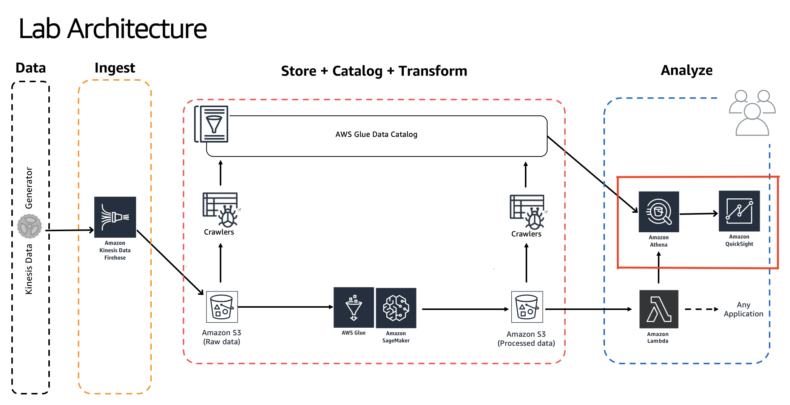

# Building Serverless Data Lakes on AWS

Author: Unni Pillai | Amazon Web Services | [Twitter](https://twitter.com/unni_k_pillai) | [Linkedin](http://bit.ly/upillai)

Updated by: Vikas Omer | Amazon Web Services | [Linkedin](https://www.linkedin.com/in/vikas-omer/)

# Pre-requisites:  
Completed the previous modules   
* Ingest and Storage [link](../modules/ingest.md)
* Catalog Data [link](../modules/catalog.md)
* Transform Data with AWS Glue [link](../modules/transform_glue.md)

# Visualize

## Setting Up QuickSight
In this step we will visualize it using QuickSight

Login to Amazon Quick Sight Console & complete the registration & sign-up

* GoTo: https://us-east-1.quicksight.aws.amazon.com/sn/start
* You should see quicksight hompage: 

## Setting QuickSight Permissions

* GoTo: https://us-east-1.quicksight.aws.amazon.com/sn/console/resources?#
* Select: **Amazon Athena**  - this enables QuickSight access to Amazon Athena databases
* Select: **Amazon S3**
	* Select: **yourname-datalake-demo-bucket**
	* Click: **Select buckets**
* Click: **Update**

## Adding a New Dataset

* GoTo: https://us-east-1.quicksight.aws.amazon.com/sn/start
* On top right, Click - **Manage Data**
    * Click - **New Data Set**
    * Click - **Athena** 
    * New Athena data source
        * Data source name: **summitdemo**
        * Click - Validate Connection 
            * This will check if your QuickSight can access Athena
            * If validation fails - click on your username on top-right > 
        * Click - **Create data source**
    * Choose your table:
        * Database: contain sets of tables: select - **summitdb**
        * Tables: contain the data you can visualize : select - **processed_data**
        * Click - **Select**
    * Finish data set creation:
        * Select - **Directly query your data**
        * Click **Visualize**

## Using Amazon Quick Sight to Visualize Our Processed Data

###  Visualization 1: Heat map of users and tracks they are listening to

In this step, we will create a visualization that show us which users are listening to repetitive tracks

* On the bottom-left panel - **Visual types**
    * Hover on icon there to see names of the visualizations
    * Click on - **Heat Map**
* On top-left panel - **Fields list**
    * Click -  **device_id**
    * Click - **track_name**
* Just above the visualization you should see **Field wells** : [**Rows - device_id**] [**Columns - track_name**]

If you hover on dark blue patches on the heatmap you will see that those particular users are listening to same track repeatedly.

### Visualization 2: Tree map of most played Artist Names

In this step we will create a visualization that shows who are the host played artists

* On top-left - Click on '**+ Add**' > **Add Visual**, this will add a new panel to the right pane
* On the bottom-left panel - **Visual types**
    * Hover on icon there to see names of the visualizations
    * Click on - **Tree Map**
* On top-left panel - **Fields list**
    * Click - **artist_name**

Play around and explore Amazon QuickSight Console. Try out filters, other visualization types, etc.

> Back to [main page](../readme.md)